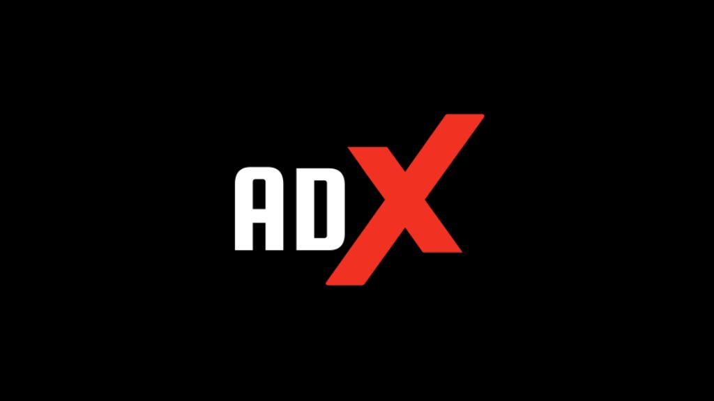

# AdExcellence

A modern web platform for managing and booking advertising hoardings/billboards. Whether you're looking to advertise your business or rent out your advertising spaces, AdExcellence makes the process simple and efficient.



## What is AdExcellence?

AdExcellence connects three key players in the outdoor advertising industry:
- **Advertisers** who want to promote their business
- **Hoarding Owners** who have advertising spaces to rent
- **Administrators** who ensure smooth operations

## Key Features

🏢 **For Businesses Looking to Advertise**
- Browse available hoardings with location details and pricing
- Easy booking system
- Secure online payments
- Track your advertising campaigns

🏗️ **For Hoarding/Billboard Owners**
- List your advertising spaces
- Manage bookings and availability
- Track your earnings
- Upload photos and location details

## Quick Start Guide

### To Use the Platform

1. Visit our website
2. Register as either an Advertiser or Hoarding Owner
3. Complete your profile verification
4. Start booking or listing hoardings!

### For Developers

Want to run this project locally? Here's how:

1. **Prerequisites**
   - Visual Studio 2022
   - SQL Server
   - .NET Framework 4.7.2

2. **Setup Steps**
   ```bash
   # 1. Clone the repository
   git clone https://github.com/laveshparyani/AdExcellence.git

   # 2. Open in Visual Studio
   # Open AdExcellence.sln

   # 3. Set up the database
   # Create a database named 'adexcel' in SQL Server

   # 4. Update connection string in Web.config
   # Change the connection string to match your SQL Server details

   # 5. Run the application
   # Press F5 in Visual Studio
   ```

## Screenshots

Here's what you can expect from our platform:

- Clean, modern interface
- Mobile-responsive design
- Easy navigation
- Secure payment system

## Support

Need help? Contact us:
- 📧 Email: laveshparyani01@gmail.com / kapillund29@gmail.com
- 💬 Visit our Contact Us page

## Team

Created by Lavesh Paryani and Kapil Lund

---
© 2024 AdExcellence. All rights reserved.
